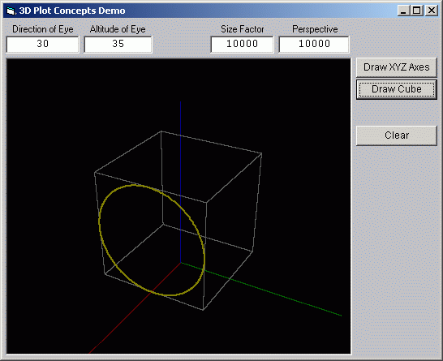



## Three\-D Plot Demo

### Description

 

This is a simple demo of the raw methodology involved in the basics of plotting 3D points on a 2D monitor screen.  

All this simple program does is compute the image of a cube one point at a time with a circle drawn on the front face.  

Anyone who wants to learn the elementary math involved in plotting a point in 3D space onto a 2D monitor can study the source and experiment with various viewpoint settings in the interface to see how they interrelate and effect things.

  

Each of the X,Y,Z axes are color coded as RGB respectively help to keep track of the image orientation.

  

Many comments in the code explain what each part does.

  
 
### More Info
 
There are only four input parameters.

The direction of view.

The angle of view from above relative to the horizon.

The size or image scale factor.

The perspective factor.

A basic understanding of the sine and cosine used in elementary trigonometry would be helpful, but is not mandatory. It would make the formulas used more meaningful.

The program simply demonstrates the mathematical concept behind plotting 3D images on a computer monitor, so the user can study the mathematical concept behind it.

It is done from scratch from direct computation using only VB 6 and the built in sine and cosine functions and native graphics methods.

It was written is a way that was intended to be simple to read.

(Don't know if this source code will work with VB5, but the formulas used certainly will).

No errors are specifically tested for, so entering extremely abnormal arguments may possibly crash the program. Only single precision values are used for the graphics plotting.

             |
---                |---
**Submitted On**   |2001-01-30 03:31:30
**By**             |[Jay Tanner](https://github.com/Planet-Source-Code/PSCIndex/blob/master/ByAuthor/jay-tanner.md)
**Level**          |Advanced
**User Rating**    |4.7 (28 globes from 6 users)
**Compatibility**  |VB 6\.0
**Category**       |[Graphics](https://github.com/Planet-Source-Code/PSCIndex/blob/master/ByCategory/graphics__1-46.md)
**World**          |[Visual Basic](https://github.com/Planet-Source-Code/PSCIndex/blob/master/ByWorld/visual-basic.md)
**Archive File**   |[CODE\_UPLOAD143011302001\.zip](https://github.com/Planet-Source-Code/jay-tanner-three-d-plot-demo__1-14817/archive/master.zip)

